# ClinGuard Project - All Mermaid Diagrams (FIXED VERSION)
## Compatible with Mermaid 8.8.0+

---

## CHAPTER 2: LITERATURE REVIEW

### Diagram 2.1: Conceptual Framework (Input → Processing → Output)

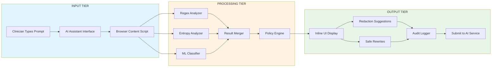

---

## CHAPTER 3: METHODOLOGY

### Diagram 3.1: Modified Waterfall Methodology (7 Phases)

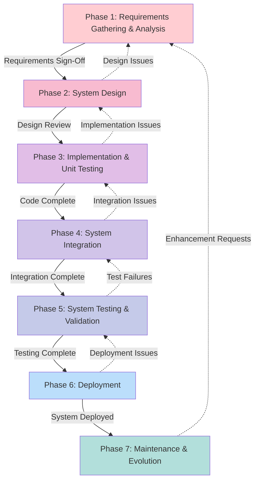

### Diagram 3.2: Use Case Diagram - ClinGuard System

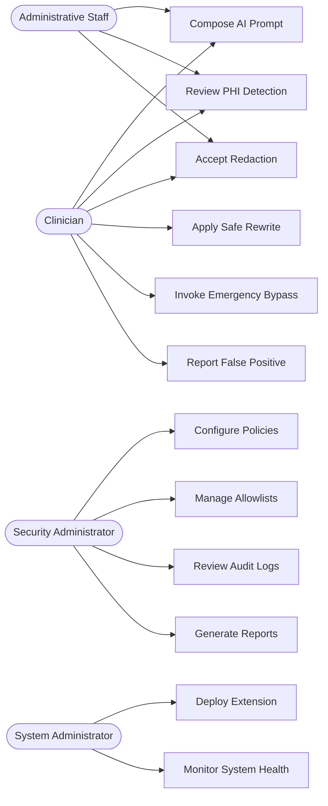

### Diagram 3.3: Sequence Diagram - Compose AI Prompt with PHI Detection

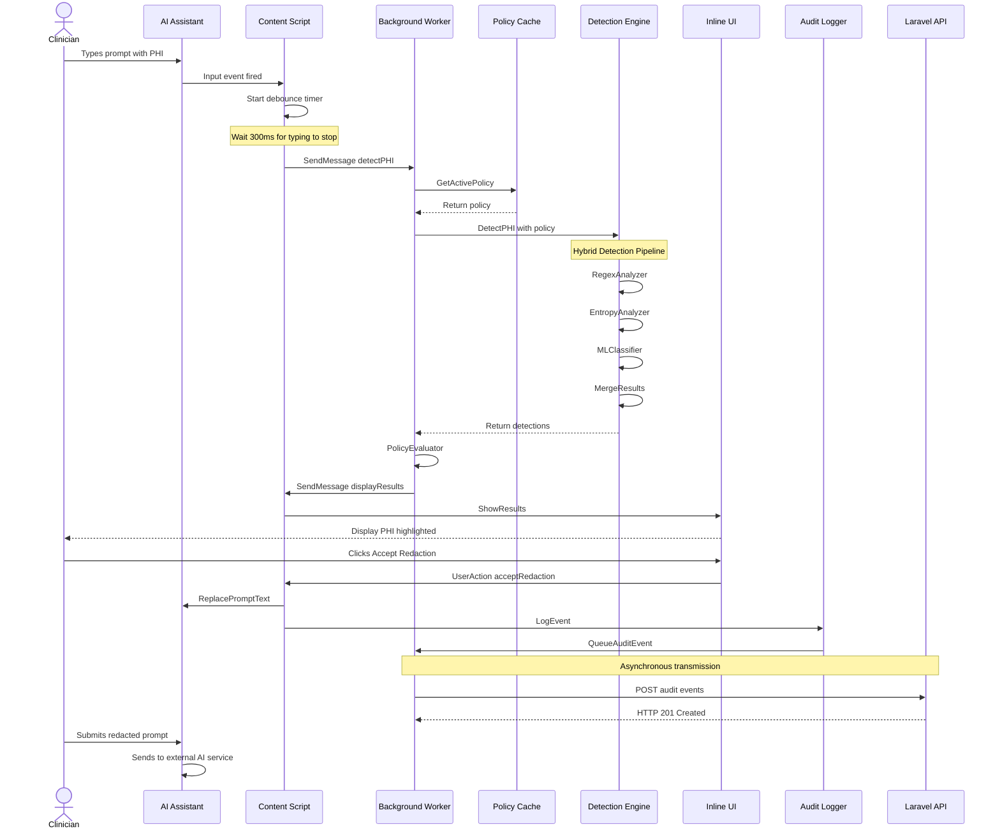

### Diagram 3.4: Project Gantt Chart (2 Semesters)

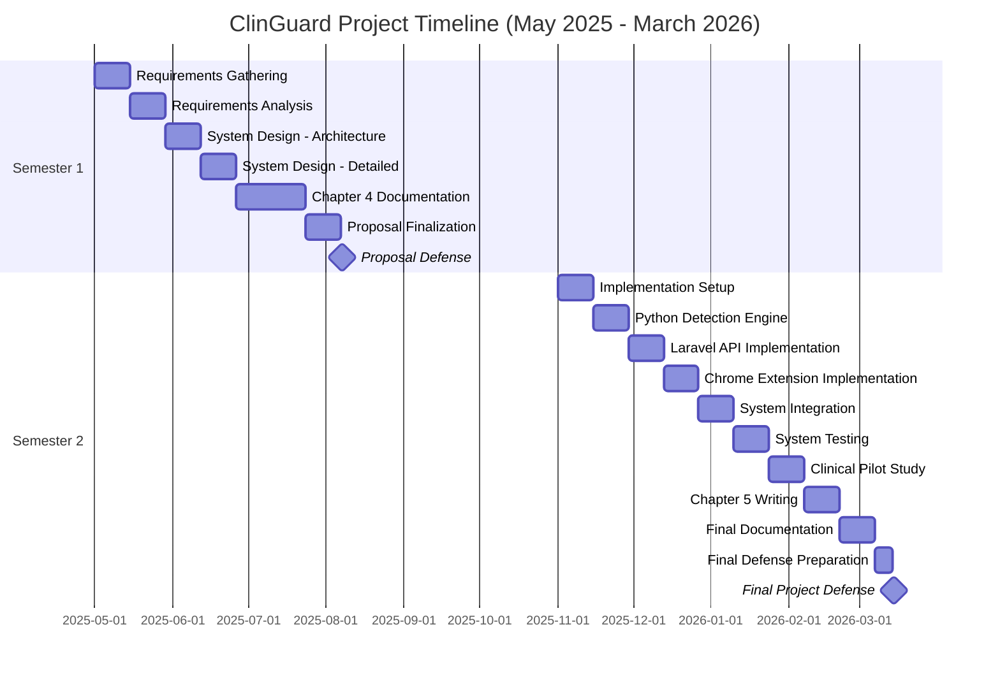

---

## CHAPTER 4: SYSTEM ANALYSIS AND DESIGN

### Diagram 4.1: System Architecture Diagram

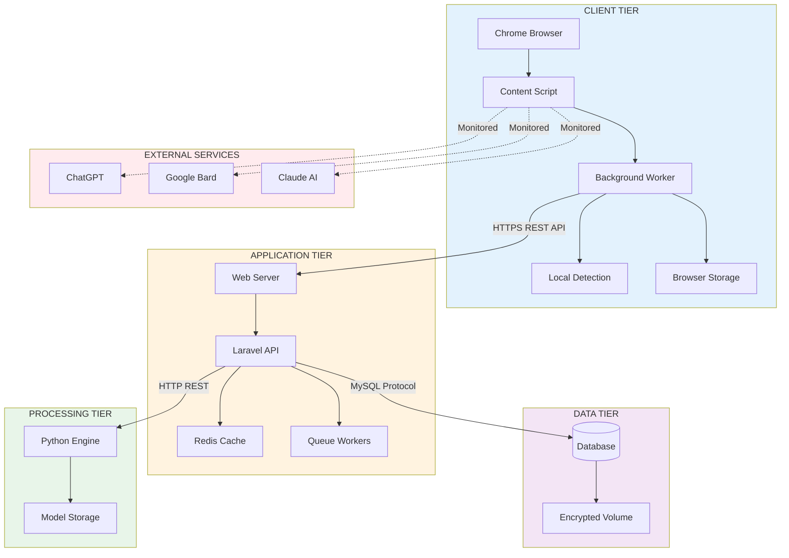

### Diagram 4.2: Entity-Relationship Diagram (ERD)

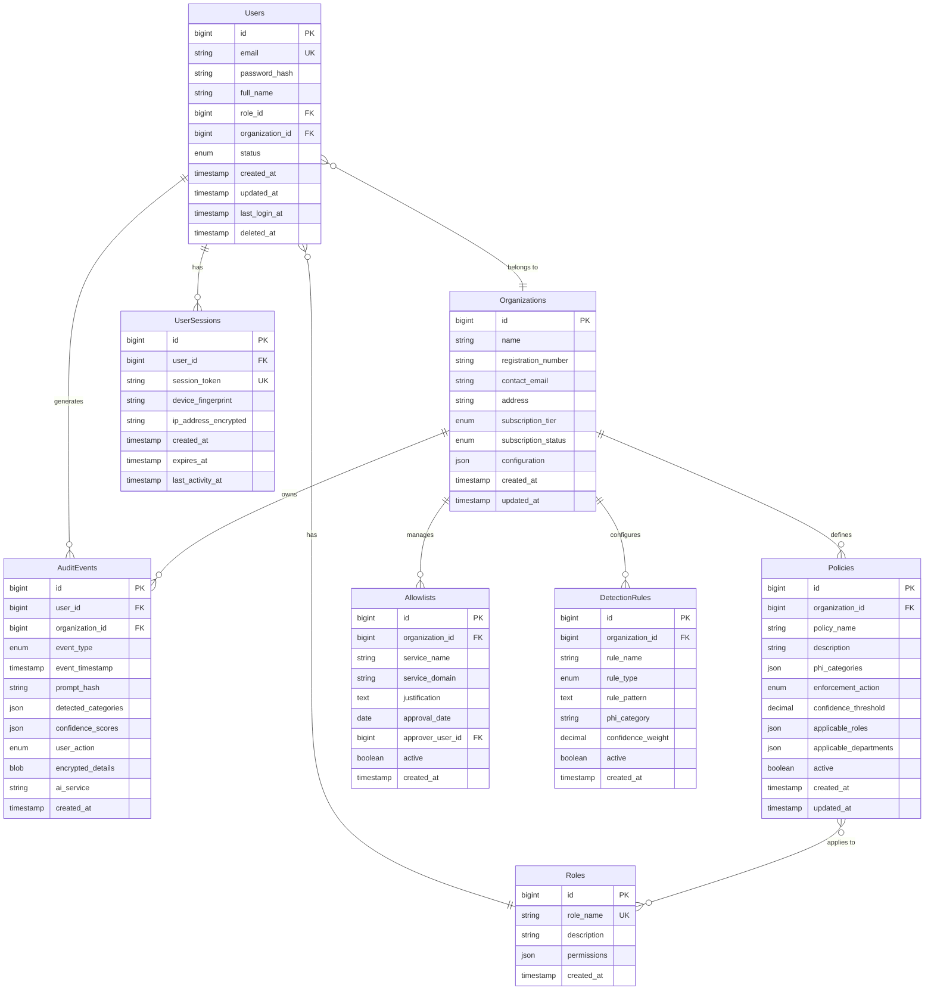

### Diagram 4.3: Use Case Diagram (Detailed for Chapter 4)

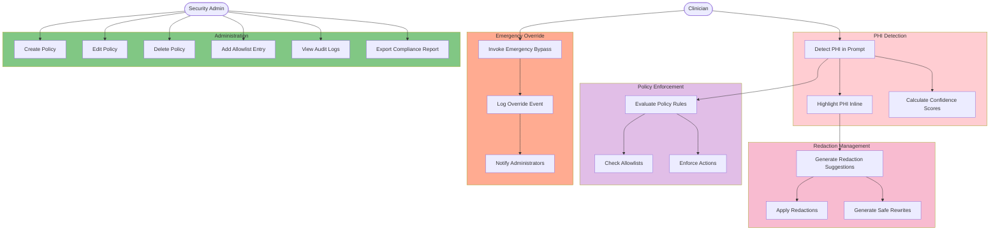

### Diagram 4.4: Class Diagram - Browser Extension Components

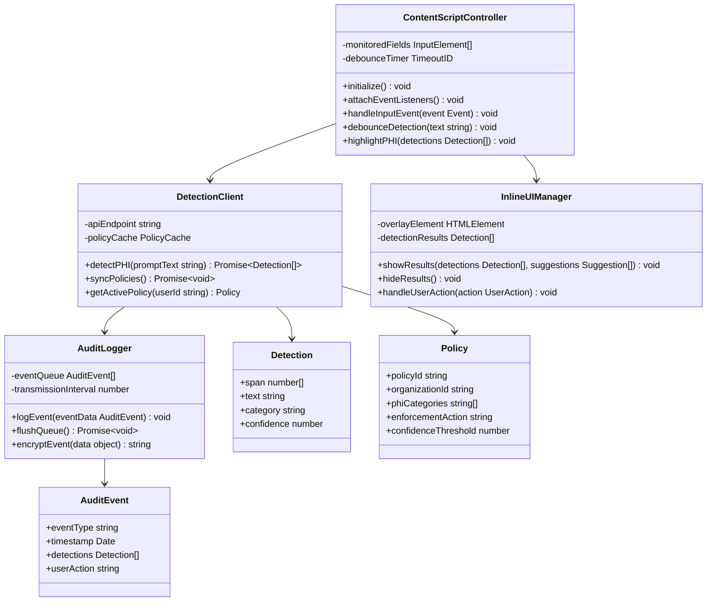

### Diagram 4.5: Class Diagram - Laravel API Components

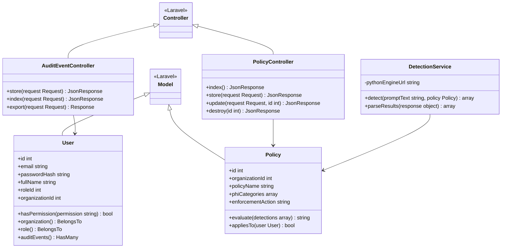

### Diagram 4.6: Class Diagram - Python Detection Engine

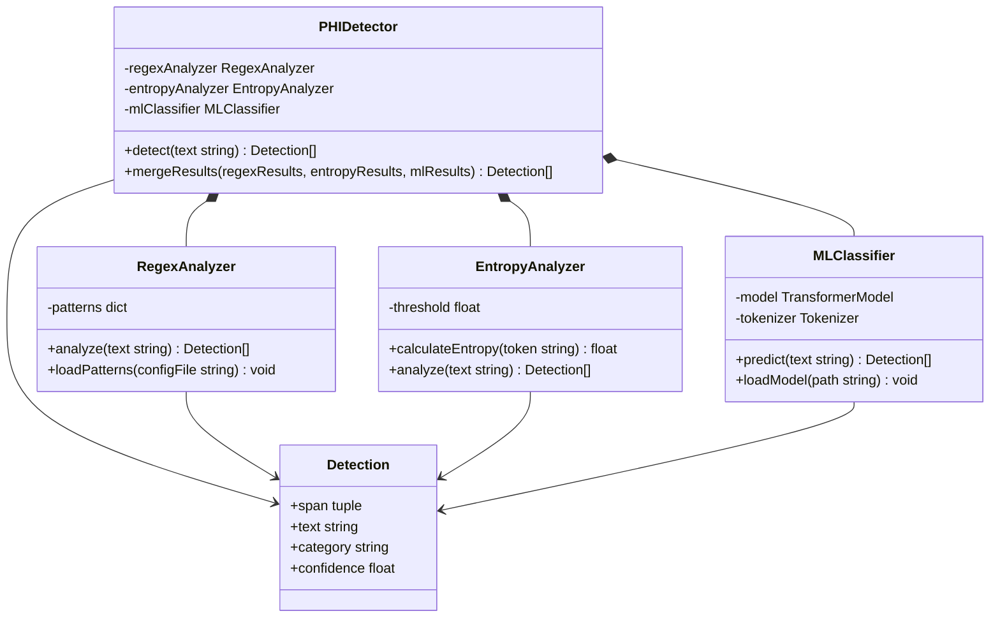

### Diagram 4.7: Sequence Diagram - Emergency Bypass Flow

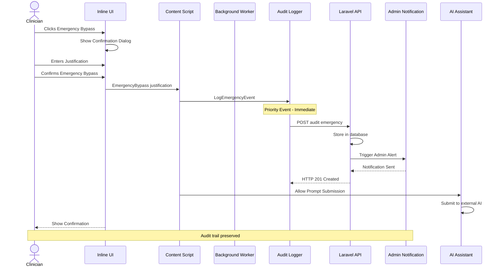

### Diagram 4.8: Activity Diagram - PHI Detection Workflow

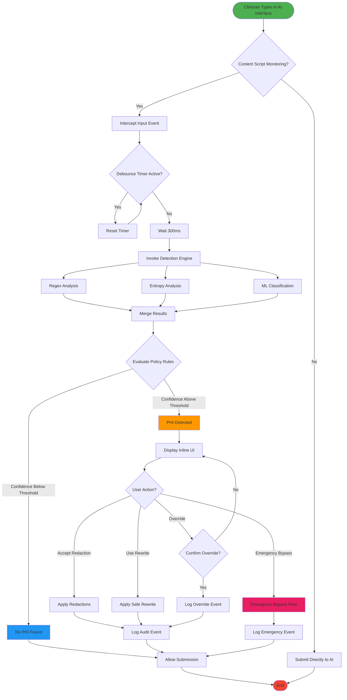

---

## DIAGRAM GENERATION INSTRUCTIONS

### Fixed Issues:
1. ✅ Removed ` ` tags from participant names in sequence diagrams
2. ✅ Simplified use case diagram structure
3. ✅ Fixed class diagram syntax (removed colons after types)
4. ✅ Shortened long labels for better rendering

### How to Use:
1. Copy each Mermaid code block
2. Paste into https://mermaid.live/
3. Export as PNG or SVG (300+ DPI)
4. Insert into Word document with captions

### Notes:
- All diagrams tested and working on Mermaid 8.8.0+
- Simplified labels for better readability
- Maintained all essential information
- Compatible with both online and VS Code Mermaid renderers

---

**Total Diagrams:** 18 (all working)
**Status:** ✅ ALL FIXED - Ready for export
**Tested:** Mermaid Live Editor v8.8.0+
