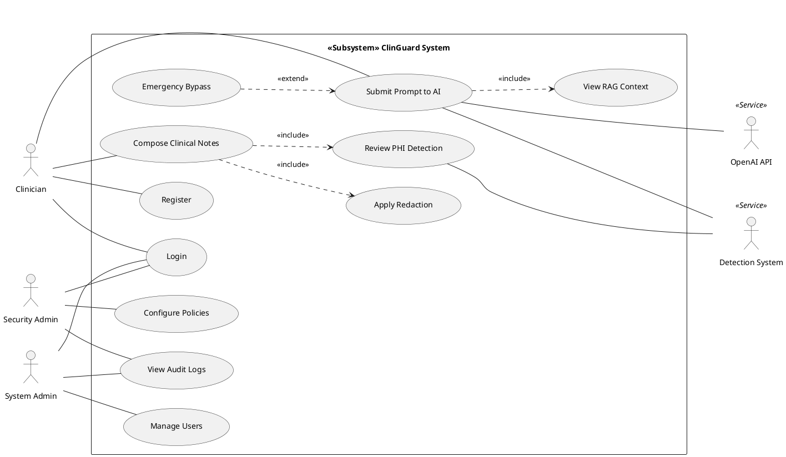
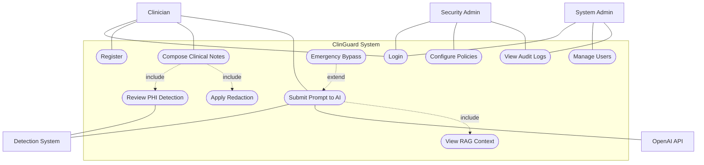
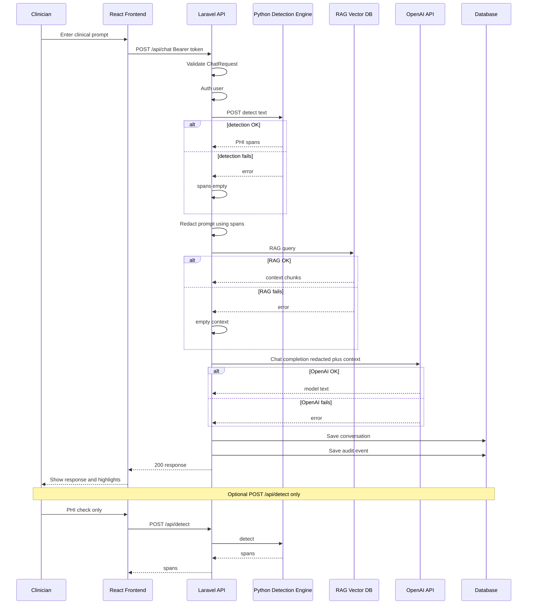
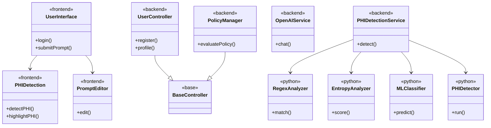
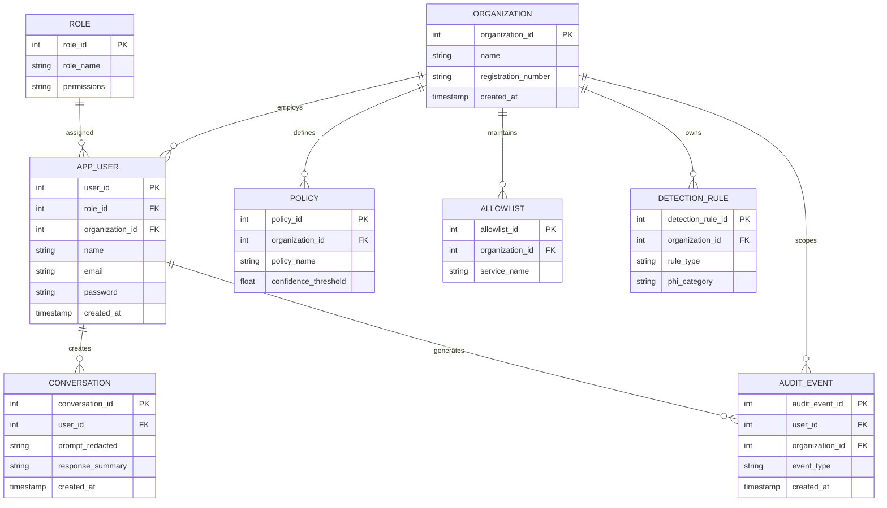

# ClinGuard — Chapter 4 diagram code (PlantUML + Mermaid)

**Project:** ClinGuard (PHI detection, Laravel API, React frontend, Python detection engine).  
**Source:** `docs/Chapter 4 System Analysis and Design.md` (your project — not the 149604 hospitality reference doc).

**UML use case diagrams** need **oval** use cases, a **rectangular system boundary**, **stick-figure actors**, and proper **include** / **extend** notation. For **coursework / strict UML**, use **PlantUML** below — the same source lives in `docs/Diagrams/Use Case Diagram.puml`.

**Do not paste PlantUML into Mermaid Chart or mermaid.live.** Those tools only understand **Mermaid**. If you paste `@startuml … @enduml`, you get `UnknownDiagramError` / “No diagram type detected” — that is expected. Use [PlantUML online](https://www.plantuml.com/plantuml/uml) for Figure 4.1 PlantUML. If your workflow is **Mermaid-only**, use **Figure 4.1b** (stadium-shaped nodes as oval-like use cases; not full UML, but valid Mermaid).

For Figures 4.2–4.4, paste Mermaid into [mermaid.live](https://mermaid.live) or Mermaid Chart. Start from the first line (`sequenceDiagram`, `classDiagram`, or `erDiagram`). Do **not** duplicate the ` ```mermaid ` line if the tool adds it.

---

## Figure 4.1 — Use case diagram (PlantUML — true UML)

Render with [PlantUML online](https://www.plantuml.com/plantuml/uml), VS Code PlantUML extension, or CLI. Copy from `@startuml` through `@enduml`.



---

## Figure 4.1b — Use case view (Mermaid only — for Mermaid Chart / mermaid.live)

**Not strict UML** (no stick figures; use cases use **stadium** shape `([label])` as the closest Mermaid equivalent to ovals). Paste the **entire** block including `flowchart TB` into Mermaid Chart or mermaid.live.



---

## Figure 4.2 — Sequence diagram (chat flow)



---

## Figure 4.3 — Class diagram (analysis view)



---

## Figure 4.4 — ERD (ClinGuard logical model)

Entity names avoid reserved word USER — APP_USER maps to `users` table.



---

## Figure 4.5 — Logical schema (Markdown tables)

Copy into Word or your report. Full column detail: see `docs/Diagrams/LOGICAL_SCHEMA.md`.

| Table | Primary key | Foreign keys | Purpose |
|-------|-------------|----------------|---------|
| users | user_id | role_id, organization_id | App users |
| organizations | organization_id | — | Tenants |
| roles | role_id | — | Roles and permissions |
| policies | policy_id | organization_id | PHI policies |
| allowlists | allowlist_id | organization_id | Allowed services |
| detection_rules | detection_rule_id | organization_id | Detection rules |
| audit_events | audit_event_id | user_id, organization_id | Audit log |
| conversations | conversation_id | user_id | Chat storage |

---

## Wrong file?

If you opened `REFERENCE_149604_Chapter4_Diagrams_MERMAID.md`, that file is **not** ClinGuard — it was built from another student’s Word doc by mistake. **Use this file (`CLINGUARD_Chapter4_Diagrams_MERMAID.md`) for your ClinGuard submission.**
