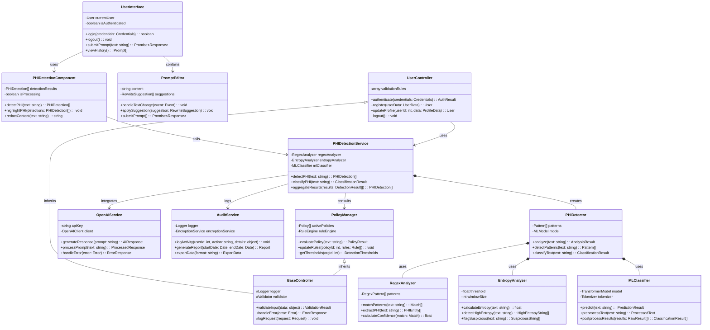

# Chapter 4: System Analysis and Design - Official UML Diagrams

## 4.3 System Analysis Diagrams (OOAD Approach)

### 4.3.1 Use Case Diagram

```mermaid
graph TB
    subgraph "ClinGuard System Boundary"
        UC1((Authenticate User))
        UC2((Submit AI Prompt))
        UC3((Detect PHI in Prompt))
        UC4((Redact PHI Content))
        UC5((Generate AI Response))
        UC6((Retrieve Clinical Knowledge))
        UC7((Manage Detection Policies))
        UC8((Generate Compliance Reports))
        UC9((Emergency Bypass))
    end
    
    Actor_Clinician[👤 Clinician]
    Actor_Admin[👥 Administrator] 
    Actor_Security[🛡️ Security Officer]
    
    Actor_Clinician --> UC1
    Actor_Clinician --> UC2
    Actor_Clinician --> UC3
    Actor_Clinician --> UC4
    Actor_Clinician --> UC5
    Actor_Clinician --> UC6
    Actor_Clinician --> UC9
    
    Actor_Admin --> UC1
    Actor_Admin --> UC7
    Actor_Admin --> UC8
    
    Actor_Security --> UC1
    Actor_Security --> UC8
    
    UC2 .> UC3 : <<include>>
    UC3 .> UC4 : <<include>>
    UC4 .> UC5 : <<include>>
    UC5 .> UC6 : <<include>>
    UC1 .> UC7 : <<extend>>
    UC1 .> UC8 : <<extend>>
    
    style Actor_Clinician fill:#e3f2fd,stroke:#1976d2,stroke-width:2px
    style Actor_Admin fill:#f3e5f5,stroke:#7b1fa2,stroke-width:2px
    style Actor_Security fill:#e8f5e8,stroke:#388e3c,stroke-width:2px
```

### 4.3.2 Sequence Diagram

```mermaid
sequenceDiagram
    participant C as 👤 Clinician
    participant UI as 🖥️ React Frontend
    participant AC as 🔐 Auth Controller
    participant PDS as 🔍 PHI Detection Service
    participant PM as ⚙️ Policy Manager
    participant RS as 📚 RAG Service
    participant OA as 🤖 OpenAI Gateway
    participant AL as 📋 Audit Logger
    participant DB as 💾 Database
    
    C->>+UI: Submit Prompt
    UI->>+AC: Validate Session
    AC->>+DB: Check User Session
    DB-->>-AC: Session Valid
    AC-->>-UI: Authentication Confirmed
    
    UI->>+PDS: Analyze Text for PHI
    PDS->>+PM: Get Detection Rules
    PM->>+DB: Fetch Active Policies
    DB-->>-PM: Policy Rules
    PM-->>-PDS: Detection Thresholds
    
    PDS->>PDS: Regex Analysis
    PDS->>PDS: Entropy Analysis
    PDS->>PDS: ML Classification
    PDS->>PDS: Aggregate Results
    
    PDS->>+AL: Log Detection Event
    AL->>+DB: Store Audit Record
    DB-->>-AL: Success
    AL-->>-PDS: Logged
    
    PDS-->>-UI: PHI Detection Results
    UI->>UI: Highlight Detected PHI
    UI->>UI: Show Redaction Options
    
    C->>UI: Confirm Redaction
    UI->>+PDS: Apply Redaction
    PDS-->>-UI: Redacted Text
    
    UI->>+RS: Retrieve Clinical Knowledge
    RS->>+DB: Search Knowledge Base
    DB-->>-RS: Relevant Information
    RS-->>-UI: Clinical Context
    
    UI->>+OA: Send Processed Prompt
    OA-->>-UI: AI Response
    UI->>+AL: Log Transaction
    AL->>+DB: Store Complete Record
    DB-->>-AL: Success
    AL-->>-UI: Logged
    
    UI-->>-C: Display Enhanced Response
```



### 4.3.3 System Sequence Diagram

```mermaid
sequenceDiagram
    participant Actor as 👤 External Actor
    participant System as 🏥 ClinGuard System
    participant DB as 💾 Database
    
    Note over Actor,DB: === Submit Prompt Event ===
    Actor->>+System: submitPrompt(promptText: string)
    System->>+DB: validateAndStore(promptText)
    DB-->>-System: promptID: int
    System-->>-Actor: processingStatus: string
    
    Note over Actor,DB: === Detect PHI Event ===
    Actor->>+System: detectPHI(promptID: int)
    System->>System: analyzePHI()
    System-->>-Actor: phiResults: array
    
    Note over Actor,DB: === Redact Content Event ===
    Actor->>+System: redactContent(promptID: int, redactionRules: object)
    System->>System: applyRedaction()
    System-->>-Actor: redactedText: string
    
    Note over Actor,DB: === Generate Response Event ===
    Actor->>+System: generateResponse(processedPrompt: string)
    System->>System: callOpenAI()
    System-->>-Actor: aiResponse: string
    
    Note over Actor,DB: === Log Activity Event ===
    Actor->>+System: logActivity(activityData: object)
    System->>+DB: storeAuditLog(activityData)
    DB-->>-System: logID: int
    System-->>-Actor: confirmation: string
```

## 4.4 System Design Diagrams (OOAD Approach)

### 4.4.1 Entity-Relationship Diagram

```mermaid
erDiagram
    USERS {
        int UserID PK "🔑"
        string FirstName "📝"
        string LastName "📝"
        string Email UK "📧"
        string PasswordHash "🔒"
        int OrganizationID FK "🏢"
        int RoleID FK "👥"
        timestamp CreatedAt "📅"
        timestamp UpdatedAt "📅"
    }
    
    ORGANIZATIONS {
        int OrganizationID PK "🔑"
        string OrganizationName "🏥"
        string ContactEmail "📧"
        string PhoneNumber "📞"
        text Address "📍"
        timestamp CreatedAt "📅"
    }
    
    ROLES {
        int RoleID PK "🔑"
        string RoleName UK "🏷️"
        text Description "📝"
        json Permissions "⚙️"
        timestamp CreatedAt "📅"
    }
    
    POLICIES {
        int PolicyID PK "🔑"
        int OrganizationID FK "🏢"
        string PolicyName "📋"
        json DetectionThresholds "🎯"
        json RedactionRules "🚫"
        boolean IsActive "✅"
        timestamp CreatedAt "📅"
    }
    
    PROMPTS {
        int PromptID PK "🔑"
        int UserID FK "👤"
        text OriginalText "📄"
        text ProcessedText "✏️"
        int RedactionCount "🔢"
        timestamp Timestamp "⏰"
        enum Status "📊"
    }
    
    PHI_DETECTIONS {
        int DetectionID PK "🔑"
        int PromptID FK "📄"
        string PHIType "🏷️"
        decimal ConfidenceScore "📈"
        int StartPosition "📍"
        int EndPosition "📍"
        string RedactionMethod "🚫"
        timestamp Timestamp "⏰"
    }
    
    AUDIT_LOGS {
        int LogID PK "🔑"
        int UserID FK "👤"
        string Action "🎯"
        string IPAddress "🌐"
        text UserAgent "🖥️"
        timestamp Timestamp "⏰"
        json Details "📋"
    }
    
    KNOWLEDGE_BASE {
        int KnowledgeID PK "🔑"
        string Title "📚"
        text Content "📄"
        string Category "🏷️"
        json VectorEmbedding "🔢"
        timestamp LastUpdated "📅"
    }
    
    USER_ROLES {
        int UserID PK,FK "🔑"
        int RoleID PK,FK "🔑"
        timestamp AssignedAt "📅"
    }
    
    USERS ||--o{ PROMPTS : "submits"
    USERS ||--o{ AUDIT_LOGS : "generates"
    USERS ||--o{ USER_ROLES : "has"
    ROLES ||--o{ USER_ROLES : "assigned_to"
    ORGANIZATIONS ||--o{ USERS : "employs"
    ORGANIZATIONS ||--o{ POLICIES : "defines"
    PROMPTS ||--o{ PHI_DETECTIONS : "contains"
```



### 4.4.2 Logical Database Schema

```mermaid
erDiagram
    USERS {
        INT UserID PK "AUTO_INCREMENT"
        VARCHAR(255) FirstName "NOT NULL"
        VARCHAR(255) LastName "NOT NULL"
        VARCHAR(255) Email "UNIQUE, NOT NULL"
        VARCHAR(255) PasswordHash "NOT NULL"
        INT OrganizationID FK
        INT RoleID FK
        TIMESTAMP CreatedAt "DEFAULT CURRENT_TIMESTAMP"
        TIMESTAMP UpdatedAt "DEFAULT CURRENT_TIMESTAMP ON UPDATE"
        INDEX idx_email (Email)
        INDEX idx_organization (OrganizationID)
    }
    
    ORGANIZATIONS {
        INT OrganizationID PK "AUTO_INCREMENT"
        VARCHAR(255) OrganizationName "NOT NULL"
        VARCHAR(255) ContactEmail "NOT NULL"
        VARCHAR(50) PhoneNumber
        TEXT Address
        TIMESTAMP CreatedAt "DEFAULT CURRENT_TIMESTAMP"
        INDEX idx_name (OrganizationName)
    }
    
    ROLES {
        INT RoleID PK "AUTO_INCREMENT"
        VARCHAR(100) RoleName "UNIQUE, NOT NULL"
        TEXT Description
        JSON Permissions
        TIMESTAMP CreatedAt "DEFAULT CURRENT_TIMESTAMP"
    }
    
    POLICIES {
        INT PolicyID PK "AUTO_INCREMENT"
        INT OrganizationID FK "NOT NULL"
        VARCHAR(255) PolicyName "NOT NULL"
        JSON DetectionThresholds
        JSON RedactionRules
        BOOLEAN IsActive "DEFAULT TRUE"
        TIMESTAMP CreatedAt "DEFAULT CURRENT_TIMESTAMP"
        INDEX idx_organization (OrganizationID)
        INDEX idx_active (IsActive)
    }
    
    PROMPTS {
        INT PromptID PK "AUTO_INCREMENT"
        INT UserID FK "NOT NULL"
        LONGTEXT OriginalText "NOT NULL"
        LONGTEXT ProcessedText
        INT RedactionCount "DEFAULT 0"
        TIMESTAMP Timestamp "DEFAULT CURRENT_TIMESTAMP"
        ENUM('submitted','processing','completed','error') Status "DEFAULT 'submitted'"
        INDEX idx_user (UserID)
        INDEX idx_timestamp (Timestamp)
        INDEX idx_status (Status)
    }
    
    PHI_DETECTIONS {
        INT DetectionID PK "AUTO_INCREMENT"
        INT PromptID FK "NOT NULL"
        VARCHAR(100) PHIType "NOT NULL"
        DECIMAL(5,4) ConfidenceScore
        INT StartPosition
        INT EndPosition
        VARCHAR(50) RedactionMethod
        TIMESTAMP Timestamp "DEFAULT CURRENT_TIMESTAMP"
        INDEX idx_prompt (PromptID)
        INDEX idx_type (PHIType)
    }
    
    AUDIT_LOGS {
        INT LogID PK "AUTO_INCREMENT"
        INT UserID FK
        VARCHAR(255) Action "NOT NULL"
        VARCHAR(45) IPAddress
        TEXT UserAgent
        TIMESTAMP Timestamp "DEFAULT CURRENT_TIMESTAMP"
        JSON Details
        INDEX idx_user (UserID)
        INDEX idx_timestamp (Timestamp)
        INDEX idx_action (Action)
    }
    
    KNOWLEDGE_BASE {
        INT KnowledgeID PK "AUTO_INCREMENT"
        VARCHAR(255) Title "NOT NULL"
        LONGTEXT Content "NOT NULL"
        VARCHAR(100) Category
        JSON VectorEmbedding
        TIMESTAMP LastUpdated "DEFAULT CURRENT_TIMESTAMP ON UPDATE"
        INDEX idx_title (Title)
        INDEX idx_category (Category)
        FULLTEXT idx_content (Content, Title)
    }
    
    USER_ROLES {
        INT UserID PK,FK
        INT RoleID PK,FK
        TIMESTAMP AssignedAt "DEFAULT CURRENT_TIMESTAMP"
        PRIMARY KEY (UserID, RoleID)
    }
    
    FOREIGN KEY (Users.OrganizationID) REFERENCES Organizations(OrganizationID)
    FOREIGN KEY (Users.RoleID) REFERENCES ROLES(RoleID)
    FOREIGN KEY (Policies.OrganizationID) REFERENCES Organizations(OrganizationID)
    FOREIGN KEY (Prompts.UserID) REFERENCES USERS(UserID)
    FOREIGN KEY (PHI_Detections.PromptID) REFERENCES PROMPTS(PromptID)
    FOREIGN KEY (Audit_Logs.UserID) REFERENCES USERS(UserID)
    FOREIGN KEY (User_Roles.UserID) REFERENCES USERS(UserID)
    FOREIGN KEY (User_Roles.RoleID) REFERENCES ROLES(RoleID)
```

### 4.4.3 Class Diagram



### 4.4.4 Component Diagram

```mermaid
graph TB
    subgraph "🎨 Presentation Layer"
        UI[User Interface Component<br/>React/TypeScript]
        UI -.-> IUI[IUserInterface<br/>Interface]
    end
    
    subgraph "⚙️ Business Logic Layer"
        AUTH[Authentication Component<br/>Laravel/PHP]
        PHI[PHI Detection Component<br/>Python/Flask]
        AI[AI Integration Component<br/>Laravel/Python]
        POLICY[Policy Management Component<br/>Laravel/PHP]
        AUDIT[Audit Component<br/>Laravel/PHP]
        
        AUTH -.-> IAuthService[IAuthService<br/>Interface]
        PHI -.-> IPHIDetectionService[IPHIDetectionService<br/>Interface]
        AI -.-> IAIService[IAIService<br/>Interface]
        POLICY -.-> IPolicyService[IPolicyService<br/>Interface]
        AUDIT -.-> IAuditService[IAuditService<br/>Interface]
    end
    
    subgraph "💾 Data Access Layer"
        DB[Database Component<br/>MySQL 8.x]
        DB -.-> IDatabaseService[IDatabaseService<br/>Interface]
    end
    
    subgraph "🌐 External Services"
        OPENAI[OpenAI API<br/>GPT-4]
        RAG[RAG Service<br/>ChromaDB]
        CHROMA[Vector Database<br/>ChromaDB]
    end
    
    subgraph "🔧 Infrastructure"
        ENCRYPT[Encryption Component<br/>AES-256]
        LOG[Logging Component<br/>Monolog]
        CACHE[Cache Component<br/>Redis]
    end
    
    UI --> AUTH
    UI --> PHI
    UI --> AI
    UI --> POLICY
    UI --> AUDIT
    
    AUTH --> DB
    PHI --> DB
    PHI --> POLICY
    AI --> OPENAI
    AI --> RAG
    POLICY --> DB
    AUDIT --> DB
    
    RAG --> CHROMA
    AUTH --> ENCRYPT
    AUDIT --> ENCRYPT
    PHI --> LOG
    AI --> LOG
    AUTH --> CACHE
    DB --> CACHE
    
    style UI fill:#e3f2fd,stroke:#1976d2,stroke-width:2px
    style AUTH fill:#f3e5f5,stroke:#7b1fa2,stroke-width:2px
    style PHI fill:#e8f5e8,stroke:#388e3c,stroke-width:2px
    style AI fill:#fff3e0,stroke:#f57c00,stroke-width:2px
    style POLICY fill:#fce4ec,stroke:#c2185b,stroke-width:2px
    style AUDIT fill:#f1f8e9,stroke:#689f38,stroke-width:2px
    style DB fill:#e0f2f1,stroke:#00796b,stroke-width:2px
```



### 4.4.5 Deployment Diagram

```mermaid
graph TB
    subgraph "🌍 Internet"
        USER[👥 End Users<br/>Web Browsers]
    end
    
    subgraph "🛡️ DMZ Zone"
        LB[⚖️ Load Balancer<br/>Nginx]
        FIREWALL[🔥 Firewall<br/>iptables/ufw]
    end
    
    subgraph "🖥️ Web Server Layer"
        WS1[🌐 Web Server 1<br/>Apache + PHP-FPM]
        WS2[🌐 Web Server 2<br/>Apache + PHP-FPM]
        WS3[🌐 Web Server 3<br/>Apache + PHP-FPM]
    end
    
    subgraph "⚡ Application Server Layer"
        LS1[🐘 Laravel Server 1<br/>PHP 8.2+]
        LS2[🐘 Laravel Server 2<br/>PHP 8.2+]
        PS1[🐍 Python Server 1<br/>Flask/FastAPI]
        PS2[🐍 Python Server 2<br/>Flask/FastAPI]
        QS[📋 Queue Server<br/>Redis/Beanstalkd]
    end
    
    subgraph "💾 Database Layer"
        DB_MASTER[(🗄️ MySQL Master<br/>Primary Database)]
        DB_SLAVE1[(🗄️ MySQL Slave 1<br/>Read Replica)]
        DB_SLAVE2[(🗄️ MySQL Slave 2<br/>Read Replica)]
        REDIS[(💽 Redis<br/>Cache & Session)]
    end
    
    subgraph "🔌 External Services"
        OPENAI[🤖 OpenAI API<br/>GPT-4 Integration]
        CHROMA[📚 ChromaDB<br/>Vector Database]
        MONITOR[📊 Prometheus/Grafana<br/>Monitoring Stack]
    end
    
    subgraph "🔐 Internal Network"
        VPN[🔑 VPN Gateway<br/>Admin Access]
    end
    
    USER --> LB
    LB --> FIREWALL
    FIREWALL --> WS1
    FIREWALL --> WS2
    FIREWALL --> WS3
    
    WS1 --> LS1
    WS2 --> LS2
    WS3 --> PS1
    WS3 --> PS2
    
    LS1 --> DB_MASTER
    LS2 --> DB_MASTER
    PS1 --> DB_MASTER
    PS2 --> DB_MASTER
    
    LS1 --> REDIS
    LS2 --> REDIS
    PS1 --> REDIS
    PS2 --> REDIS
    
    DB_MASTER --> DB_SLAVE1
    DB_MASTER --> DB_SLAVE2
    
    PS1 --> QS
    PS2 --> QS
    
    PS1 --> OPENAI
    PS1 --> CHROMA
    PS2 --> OPENAI
    PS2 --> CHROMA
    
    LS1 --> MONITOR
    LS2 --> MONITOR
    PS1 --> MONITOR
    PS2 --> MONITOR
    
    VPN --> FIREWALL
    
    style LB fill:#ffecb3,stroke:#f57f17,stroke-width:2px
    style FIREWALL fill:#ffcdd2,stroke:#c62828,stroke-width:2px
    style DB_MASTER fill:#c8e6c9,stroke:#2e7d32,stroke-width:2px
    style DB_SLAVE1 fill:#c8e6c9,stroke:#2e7d32,stroke-width:2px
    style DB_SLAVE2 fill:#c8e6c9,stroke:#2e7d32,stroke-width:2px
    style REDIS fill:#ffccbc,stroke:#d84315,stroke-width:2px
    style OPENAI fill:#e1bee7,stroke:#6a1b9a,stroke-width:2px
    style CHROMA fill:#e1bee7,stroke:#6a1b9a,stroke-width:2px
```



---

## 📋 UML Standards and Best Practices Applied:

### ✅ **Use Case Diagram Standards:**
- Actors represented with stick figure notation
- Use cases shown as ovals within system boundary
- Include/extend relationships properly labeled
- Clear actor-to-use-case associations

### ✅ **Sequence Diagram Standards:**
- Lifelines with proper activation boxes
- Synchronous and asynchronous message arrows
- Return messages clearly indicated
- Proper participant ordering and spacing

### ✅ **ERD Standards:**
- Primary keys clearly marked (PK)
- Foreign keys properly identified (FK)
- Relationship cardinalities shown (one-to-many, many-to-many)
- Data types and constraints specified

### ✅ **Class Diagram Standards:**
- Proper visibility modifiers (+, -, #)
- Method signatures with parameters and return types
- Inheritance, composition, and aggregation relationships
- Association multiplicities where applicable

### ✅ **Component Diagram Standards:**
- Components with proper interfaces
- Dependency relationships clearly shown
- Layered architecture representation
- External service integration points

### ✅ **Deployment Diagram Standards:**
- Physical nodes properly labeled
- Network zones clearly separated
- Communication protocols indicated
- Scalability and redundancy considerations

All diagrams follow UML 2.5 specifications and are compatible with Mermaid 8.8.0+ for rendering in documentation tools.
