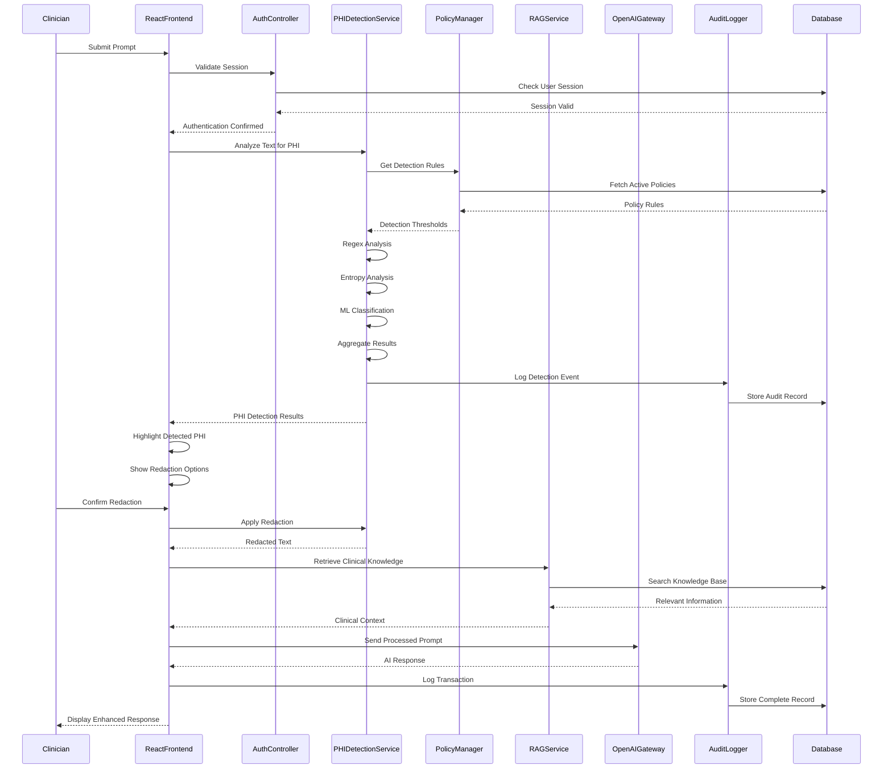
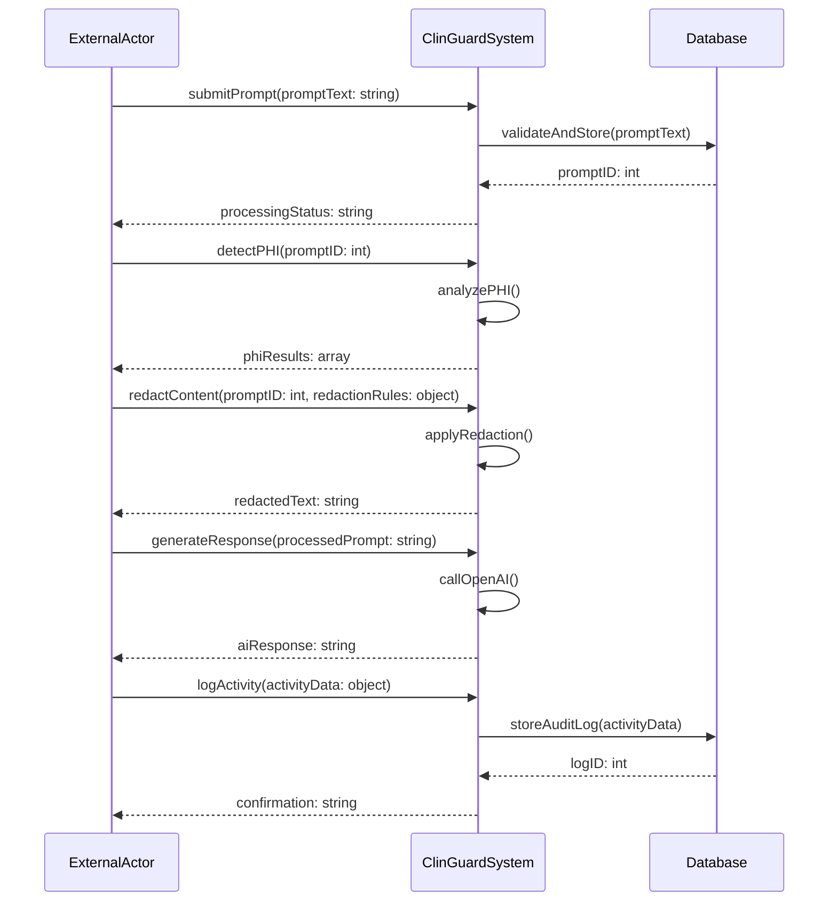
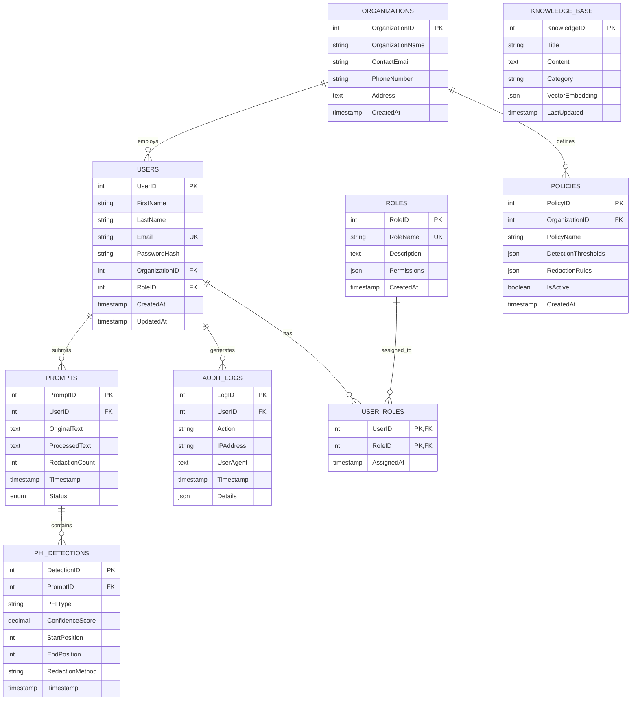
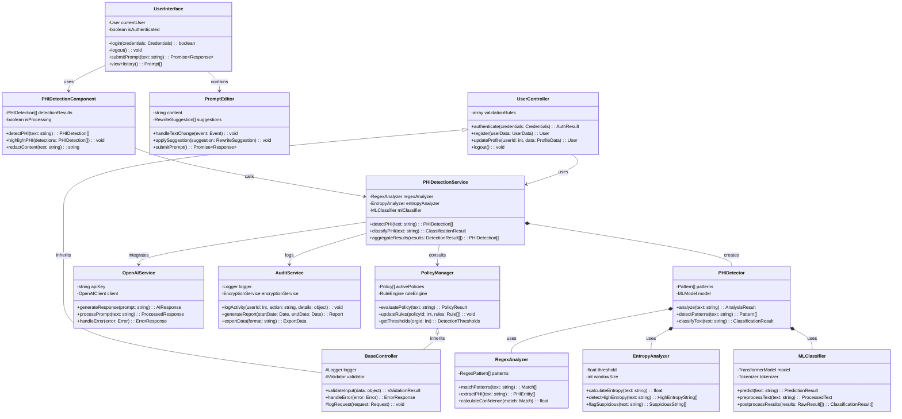
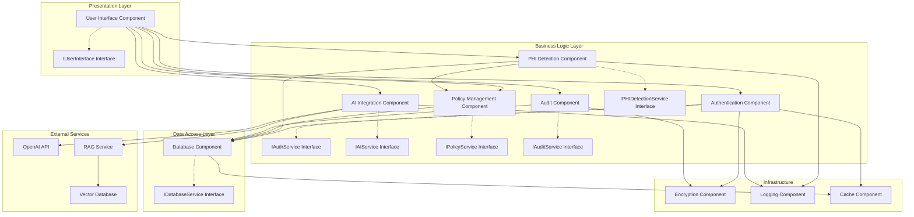
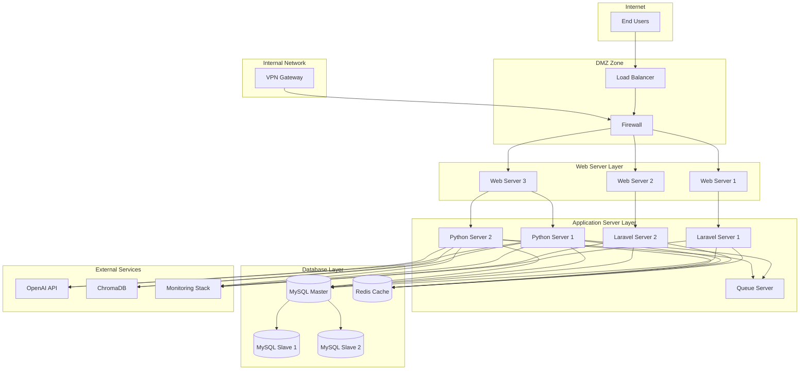

# Chapter 4: System Analysis and Design
## 4.3 System Analysis Diagrams (OOAD Approach)

### 4.3.1 Use Case Diagram

```mermaid
graph LR

    subgraph CG["ClinGuard System"]
        UC1(Authenticate)
        UC2(Submit Prompt)
        UC3(Detect PHI)
        UC4(Redact Content)
        UC5(Generate Response)
        UC6(Retrieve Knowledge)
        UC7(Manage Policies)
        UC8(Generate Reports)
        UC9(Emergency Bypass)
    end

    Clinician[Clinician]
    Administrator[Administrator]
    SecurityOfficer[Security Officer]

    Clinician --- UC1
    Clinician --- UC2
    Clinician --- UC3
    Clinician --- UC4
    Clinician --- UC5
    Clinician --- UC6
    Clinician --- UC9

    Administrator --- UC1
    Administrator --- UC7
    Administrator --- UC8

    SecurityOfficer --- UC1
    SecurityOfficer --- UC8

    UC2 ..> UC3
    UC3 ..> UC4
    UC4 ..> UC5
    UC5 ..> UC6
    UC1 ..> UC7
    UC1 ..> UC8

    style Clinician fill:#e3f2fd,stroke:#1976d2,stroke-width:2px
    style Administrator fill:#f3e5f5,stroke:#7b1fa2,stroke-width:2px
    style SecurityOfficer fill:#e8f5e8,stroke:#388e3c,stroke-width:2px
```

### 4.3.2 Sequence Diagram



### 4.3.3 System Sequence Diagram



## 4.4 System Design Diagrams (OOAD Approach)

### 4.4.1 Entity-Relationship Diagram



### 4.4.2 Logical Database Schema

```mermaid
erDiagram
    USERS {
        INT UserID PK AUTO_INCREMENT
        VARCHAR(255) FirstName NOT NULL
        VARCHAR(255) LastName NOT NULL
        VARCHAR(255) Email UNIQUE NOT NULL
        VARCHAR(255) PasswordHash NOT NULL
        INT OrganizationID FK
        INT RoleID FK
        TIMESTAMP CreatedAt DEFAULT CURRENT_TIMESTAMP
        TIMESTAMP UpdatedAt DEFAULT CURRENT_TIMESTAMP ON UPDATE
        INDEX idx_email (Email)
        INDEX idx_organization (OrganizationID)
    }
    
    ORGANIZATIONS {
        INT OrganizationID PK AUTO_INCREMENT
        VARCHAR(255) OrganizationName NOT NULL
        VARCHAR(255) ContactEmail NOT NULL
        VARCHAR(50) PhoneNumber
        TEXT Address
        TIMESTAMP CreatedAt DEFAULT CURRENT_TIMESTAMP
        INDEX idx_name (OrganizationName)
    }
    
    ROLES {
        INT RoleID PK AUTO_INCREMENT
        VARCHAR(100) RoleName UNIQUE NOT NULL
        TEXT Description
        JSON Permissions
        TIMESTAMP CreatedAt DEFAULT CURRENT_TIMESTAMP
    }
    
    POLICIES {
        INT PolicyID PK AUTO_INCREMENT
        INT OrganizationID FK NOT NULL
        VARCHAR(255) PolicyName NOT NULL
        JSON DetectionThresholds
        JSON RedactionRules
        BOOLEAN IsActive DEFAULT TRUE
        TIMESTAMP CreatedAt DEFAULT CURRENT_TIMESTAMP
        INDEX idx_organization (OrganizationID)
        INDEX idx_active (IsActive)
    }
    
    PROMPTS {
        INT PromptID PK AUTO_INCREMENT
        INT UserID FK NOT NULL
        LONGTEXT OriginalText NOT NULL
        LONGTEXT ProcessedText
        INT RedactionCount DEFAULT 0
        TIMESTAMP Timestamp DEFAULT CURRENT_TIMESTAMP
        ENUM('submitted','processing','completed','error') Status DEFAULT 'submitted'
        INDEX idx_user (UserID)
        INDEX idx_timestamp (Timestamp)
        INDEX idx_status (Status)
    }
    
    PHI_DETECTIONS {
        INT DetectionID PK AUTO_INCREMENT
        INT PromptID FK NOT NULL
        VARCHAR(100) PHIType NOT NULL
        DECIMAL(5,4) ConfidenceScore
        INT StartPosition
        INT EndPosition
        VARCHAR(50) RedactionMethod
        TIMESTAMP Timestamp DEFAULT CURRENT_TIMESTAMP
        INDEX idx_prompt (PromptID)
        INDEX idx_type (PHIType)
    }
    
    AUDIT_LOGS {
        INT LogID PK AUTO_INCREMENT
        INT UserID FK
        VARCHAR(255) Action NOT NULL
        VARCHAR(45) IPAddress
        TEXT UserAgent
        TIMESTAMP Timestamp DEFAULT CURRENT_TIMESTAMP
        JSON Details
        INDEX idx_user (UserID)
        INDEX idx_timestamp (Timestamp)
        INDEX idx_action (Action)
    }
    
    KNOWLEDGE_BASE {
        INT KnowledgeID PK AUTO_INCREMENT
        VARCHAR(255) Title NOT NULL
        LONGTEXT Content NOT NULL
        VARCHAR(100) Category
        JSON VectorEmbedding
        TIMESTAMP LastUpdated DEFAULT CURRENT_TIMESTAMP ON UPDATE
        INDEX idx_title (Title)
        INDEX idx_category (Category)
        FULLTEXT idx_content (Content, Title)
    }
    
    USER_ROLES {
        INT UserID PK,FK
        INT RoleID PK,FK
        TIMESTAMP AssignedAt DEFAULT CURRENT_TIMESTAMP
        PRIMARY KEY (UserID, RoleID)
    }
    
    FOREIGN KEY (Users.OrganizationID) REFERENCES Organizations(OrganizationID)
    FOREIGN KEY (Users.RoleID) REFERENCES ROLES(RoleID)
    FOREIGN KEY (Policies.OrganizationID) REFERENCES Organizations(OrganizationID)
    FOREIGN KEY (Prompts.UserID) REFERENCES USERS(UserID)
    FOREIGN KEY (PHI_Detections.PromptID) REFERENCES PROMPTS(PromptID)
    FOREIGN KEY (Audit_Logs.UserID) REFERENCES USERS(UserID)
    FOREIGN KEY (User_Roles.UserID) REFERENCES USERS(UserID)
    FOREIGN KEY (User_Roles.RoleID) REFERENCES ROLES(RoleID)
```

### 4.4.3 Class Diagram



### 4.4.4 Component Diagram



### 4.4.5 Deployment Diagram



---

## UML Standards Compliance

All diagrams follow UML 2.5 specifications with proper notation, relationships, and professional presentation suitable for academic documentation.
