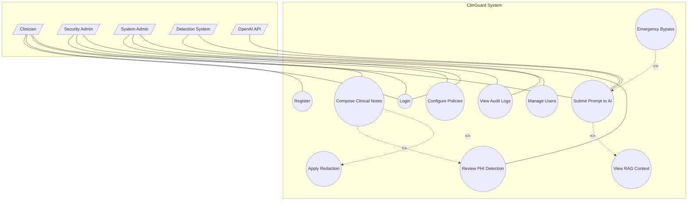
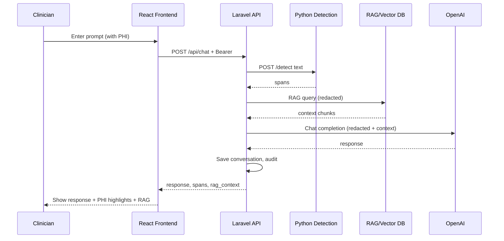
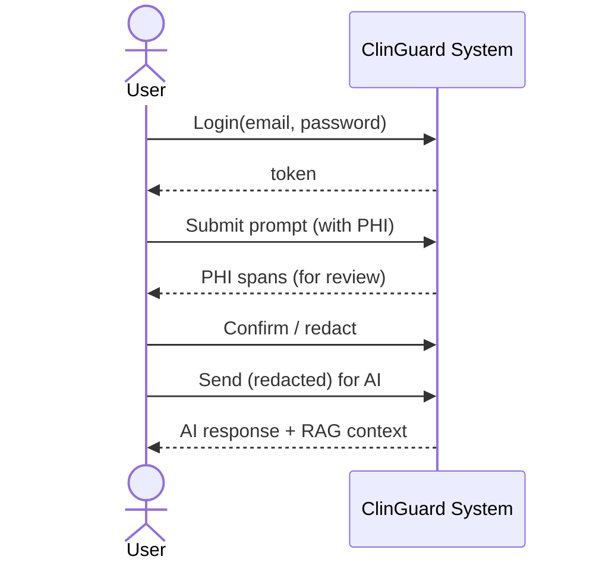
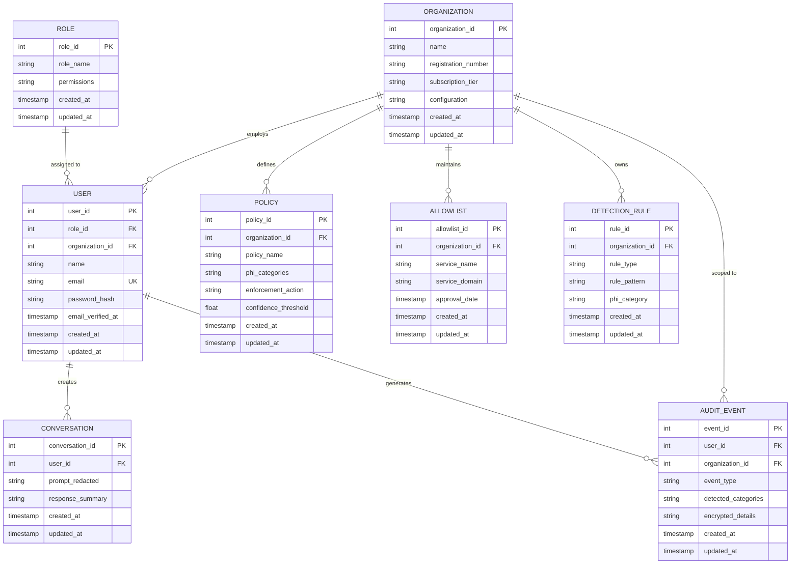
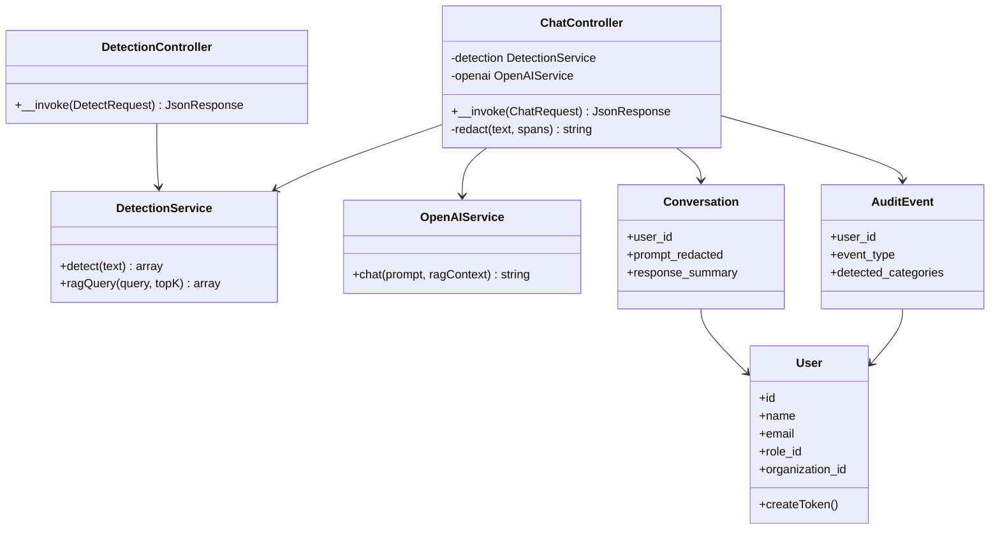
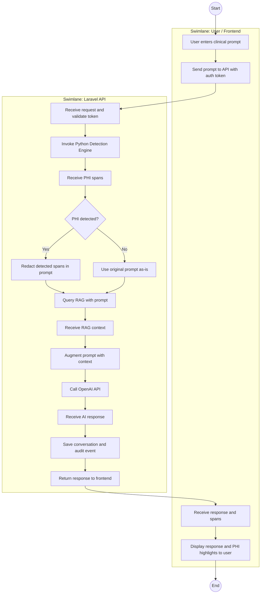

# ClinGuard – OOAD Diagrams (Mermaid Preview)

**This project is OOAD only.** Only Object-Oriented Analysis and Design diagrams are included here (no SSAD/SSADM).

Open this file and use **Markdown: Open Preview** (Ctrl+Shift+V) to render. Use a Mermaid-supported extension if needed.

---

## 1. Use Case Diagram (OOAD – Analysis)

**UML notations:** Actors (top, parallelogram) | Use cases = ovals inside **system boundary** (rectangle) | **Association** = line actor–use case | **<<include>>** / **<<extend>>** = dashed arrows. Layout: **flowchart TB** to reduce line congestion.

---

## 2. Sequence Diagram (OOAD – Analysis)

---

## 3. System Sequence Diagram (OOAD – Analysis)

---

## 4. ERD (Design)

**Standard elements:** *Entities* (rectangles) with *attributes*; *primary key* (PK) and *foreign key* (FK) marked; *relationships* as verb phrases; *cardinality*: one-to-many (||--o{), many-to-one (}o--||). Represents the logical structure of the ClinGuard database.

---

## 5. Class Diagram (Design)

---

## 6. Activity Diagram (OOAD – UML)

**Standard UML notations:** *Initial state* (filled circle), *Activity state* (rounded rectangle), *Control flow* (arrows), *Decision node* (diamond) with *guards* [Yes]/[No], *Merge* (multiple flows into one activity), *Swimlanes* (User/Frontend and Laravel API), *Final state* (circle within circle). Shows the workflow for submitting a prompt with PHI detection and AI response.

---

*OOAD only. Source `.mmd` files are in this folder. Logical schema: `LOGICAL_SCHEMA.md`. SSAD files (`context.mmd`, `dfd-level1.mmd`) are not part of this project and can be ignored or removed.*
