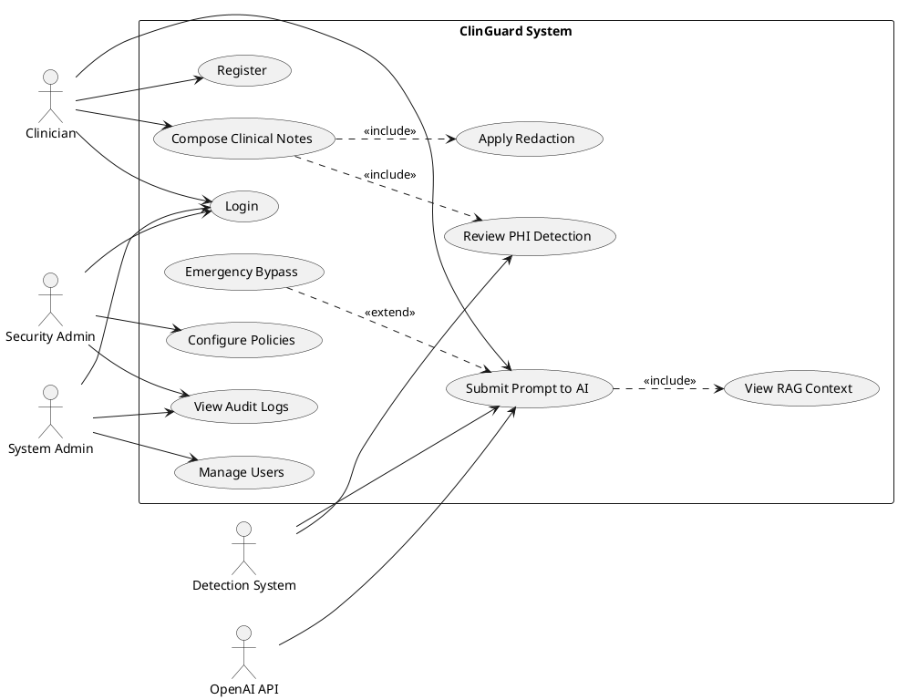
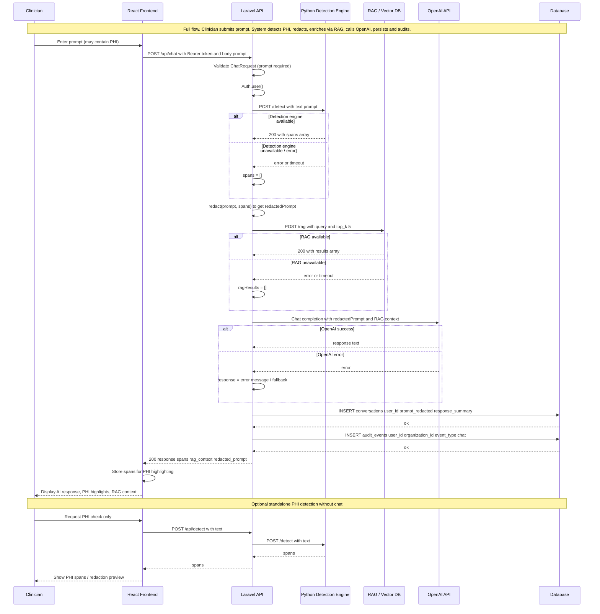
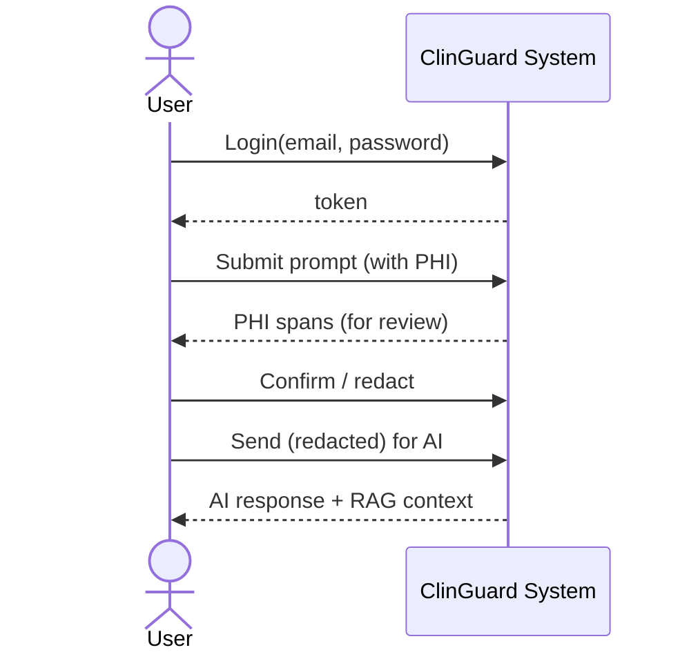
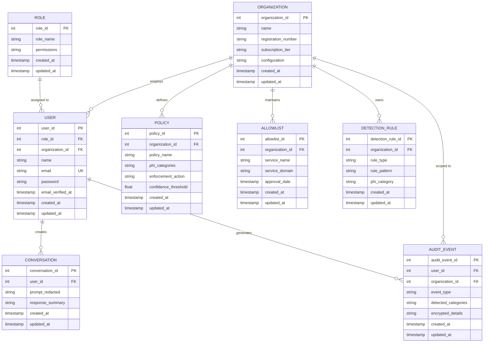
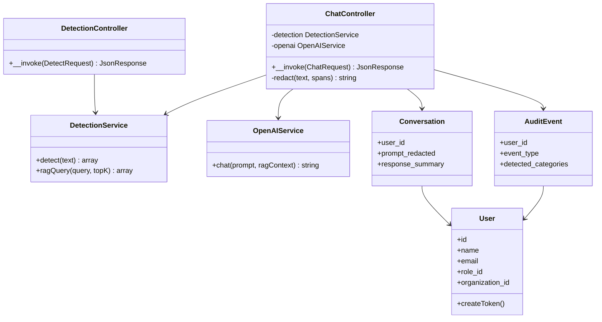
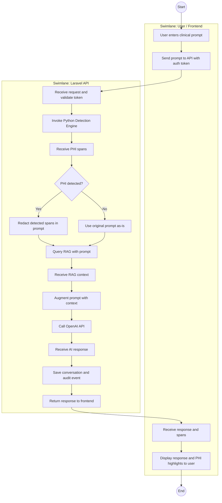

# ClinGuard – OOAD Diagrams (Mermaid Preview)

**This project is OOAD only.** Only Object-Oriented Analysis and Design diagrams are included here (no SSAD/SSADM).

Open this file and use **Markdown: Open Preview** (Ctrl+Shift+V) to render. Use a Mermaid-supported extension if needed.

---

## 1. Use Case Diagram (OOAD – Analysis)

**Academic UML:** Stick-figure **actors**, oval **use cases**, **system boundary** rectangle, **include** / **extend** with dashed arrows. Use **PlantUML** for the correct look.

**To generate the diagram:** Open **`Use Case Diagram.puml`** (or `use-case.puml`) in this folder and render with PlantUML (CLI: `plantuml "Use Case Diagram.puml"`, or VS Code PlantUML extension, or paste at [plantuml.com/plantuml/uml](https://www.plantuml.com/plantuml/uml)). Export to PNG/SVG for submission.

```plantuml
@startuml ClinGuard Use Case Diagram
left to right direction
skinparam packageStyle rectangle

actor "Clinician" as Clinician
actor "Security Admin" as SecurityAdmin
actor "System Admin" as SystemAdmin
actor "Detection System" as DetectionSystem
actor "OpenAI API" as OpenAI

rectangle "ClinGuard System" {
  (Login) as UC_Login
  (Register) as UC_Register
  (Compose Clinical Notes) as UC_Compose
  (Review PHI Detection) as UC_ReviewPHI
  (Apply Redaction) as UC_Redact
  (Submit Prompt to AI) as UC_SubmitAI
  (View RAG Context) as UC_ViewRAG
  (Emergency Bypass) as UC_Emergency
  (Configure Policies) as UC_ConfigurePolicies
  (View Audit Logs) as UC_ViewAudit
  (Manage Users) as UC_ManageUsers
}

Clinician --> UC_Login
Clinician --> UC_Register
Clinician --> UC_Compose
Clinician --> UC_SubmitAI
SecurityAdmin --> UC_Login
SecurityAdmin --> UC_ConfigurePolicies
SecurityAdmin --> UC_ViewAudit
SystemAdmin --> UC_Login
SystemAdmin --> UC_ManageUsers
SystemAdmin --> UC_ViewAudit
DetectionSystem --> UC_ReviewPHI
DetectionSystem --> UC_SubmitAI
OpenAI --> UC_SubmitAI
UC_Compose ..> UC_ReviewPHI : <<include>>
UC_Compose ..> UC_Redact : <<include>>
UC_SubmitAI ..> UC_ViewRAG : <<include>>
UC_Emergency ..> UC_SubmitAI : <<extend>>
@enduml
```

*Source files: `Use Case Diagram.puml`, `use-case.puml`*

---

## 2. Sequence Diagram (OOAD – Analysis)

**Full flow:** Validation, auth, PHI detection, redaction, RAG, OpenAI, conversation and audit persistence, response. Includes alt blocks for detection/RAG/OpenAI errors and optional standalone detect flow.

```mermaid
sequenceDiagram
  participant C as Clinician
  participant F as React Frontend
  participant L as Laravel API
  participant D as Python Detection Engine
  participant R as RAG / Vector DB
  participant O as OpenAI API
  participant DB as Database

  Note over C, DB: Full flow. Clinician submits prompt. System detects PHI, redacts, enriches via RAG, calls OpenAI, persists and audits.

  C->>F: Enter prompt (may contain PHI)
  F->>L: POST /api/chat with Bearer token and body prompt

  L->>L: Validate ChatRequest (prompt required)
  L->>L: Auth.user()

  L->>D: POST /detect with text prompt

  alt Detection engine available
    D-->>L: 200 with spans array
  else Detection engine unavailable / error
    D-->>L: error or timeout
    L->>L: spans = []
  end

  L->>L: redact(prompt, spans) to get redactedPrompt

  L->>R: POST /rag with query and top_k 5

  alt RAG available
    R-->>L: 200 with results array
  else RAG unavailable
    R-->>L: error or timeout
    L->>L: ragResults = []
  end

  L->>O: Chat completion with redactedPrompt and RAG context

  alt OpenAI success
    O-->>L: response text
  else OpenAI error
    O-->>L: error
    L->>L: response = error message / fallback
  end

  L->>DB: INSERT conversations user_id prompt_redacted response_summary
  DB-->>L: ok

  L->>DB: INSERT audit_events user_id organization_id event_type chat
  DB-->>L: ok

  L-->>F: 200 response spans rag_context redacted_prompt
  F->>F: Store spans for PHI highlighting
  F-->>C: Display AI response, PHI highlights, RAG context

  Note over C, DB: Optional standalone PHI detection without chat
  C->>F: Request PHI check only
  F->>L: POST /api/detect with text
  L->>D: POST /detect with text
  D-->>L: spans
  L-->>F: spans
  F-->>C: Show PHI spans / redaction preview
```

---

## 3. System Sequence Diagram (OOAD – Analysis)

```mermaid
sequenceDiagram
  actor User
  participant ClinGuard as ClinGuard System
  User->>ClinGuard: Login(email, password)
  ClinGuard-->>User: token
  User->>ClinGuard: Submit prompt (with PHI)
  ClinGuard-->>User: PHI spans (for review)
  User->>ClinGuard: Confirm / redact
  User->>ClinGuard: Send (redacted) for AI
  ClinGuard-->>User: AI response + RAG context
```

---

## 4. ERD (Design)

**Standard elements:** *Entities* (rectangles) with *attributes*; PK uses exact entity name (user_id, organization_id, role_id, policy_id, allowlist_id, detection_rule_id, audit_event_id, conversation_id) to distinguish; DB column is `id`. FKs = role_id, organization_id, user_id. Aligned with [LOGICAL_SCHEMA.md](LOGICAL_SCHEMA.md).

```mermaid
erDiagram
  ORGANIZATION ||--o{ USER : "employs"
  ORGANIZATION ||--o{ POLICY : "defines"
  ORGANIZATION ||--o{ ALLOWLIST : "maintains"
  ORGANIZATION ||--o{ DETECTION_RULE : "owns"
  ORGANIZATION ||--o{ AUDIT_EVENT : "scoped to"
  ROLE ||--o{ USER : "assigned to"
  USER ||--o{ CONVERSATION : "creates"
  USER ||--o{ AUDIT_EVENT : "generates"

  USER {
    int user_id PK
    int role_id FK
    int organization_id FK
    string name
    string email UK
    string password
    timestamp email_verified_at
    timestamp created_at
    timestamp updated_at
  }

  ORGANIZATION {
    int organization_id PK
    string name
    string registration_number
    string subscription_tier
    string configuration
    timestamp created_at
    timestamp updated_at
  }

  ROLE {
    int role_id PK
    string role_name
    string permissions
    timestamp created_at
    timestamp updated_at
  }

  POLICY {
    int policy_id PK
    int organization_id FK
    string policy_name
    string phi_categories
    string enforcement_action
    float confidence_threshold
    timestamp created_at
    timestamp updated_at
  }

  ALLOWLIST {
    int allowlist_id PK
    int organization_id FK
    string service_name
    string service_domain
    timestamp approval_date
    timestamp created_at
    timestamp updated_at
  }

  DETECTION_RULE {
    int detection_rule_id PK
    int organization_id FK
    string rule_type
    string rule_pattern
    string phi_category
    timestamp created_at
    timestamp updated_at
  }

  AUDIT_EVENT {
    int audit_event_id PK
    int user_id FK
    int organization_id FK
    string event_type
    string detected_categories
    string encrypted_details
    timestamp created_at
    timestamp updated_at
  }

  CONVERSATION {
    int conversation_id PK
    int user_id FK
    string prompt_redacted
    string response_summary
    timestamp created_at
    timestamp updated_at
  }
```

---

## 5. Class Diagram (Design)

*Attributes match Laravel/Eloquent and database column names (id, role_id, organization_id, user_id, etc.).*

```mermaid
classDiagram
  class DetectionController {
    +__invoke(DetectRequest) JsonResponse
  }
  class ChatController {
    -detection DetectionService
    -openai OpenAIService
    +__invoke(ChatRequest) JsonResponse
    -redact(text, spans) string
  }
  class DetectionService {
    +detect(text) array
    +ragQuery(query, topK) array
  }
  class OpenAIService {
    +chat(prompt, ragContext) string
  }
  class User {
    +id
    +name
    +email
    +role_id
    +organization_id
    +createToken()
  }
  class Conversation {
    +user_id
    +prompt_redacted
    +response_summary
  }
  class AuditEvent {
    +user_id
    +event_type
    +detected_categories
  }
  ChatController --> DetectionService
  ChatController --> OpenAIService
  ChatController --> Conversation
  ChatController --> AuditEvent
  DetectionController --> DetectionService
  Conversation --> User
  AuditEvent --> User
```

---

## 6. Activity Diagram (OOAD – UML)

**Standard UML notations:** *Initial state* (filled circle), *Activity state* (rounded rectangle), *Control flow* (arrows), *Decision node* (diamond) with *guards* [Yes]/[No], *Merge* (multiple flows into one activity), *Swimlanes* (User/Frontend and Laravel API), *Final state* (circle within circle). Shows the workflow for submitting a prompt with PHI detection and AI response.

```mermaid
flowchart TD
  Start((Start))
  End1((End))

  subgraph Swimlane_User["Swimlane: User / Frontend"]
    A1[User enters clinical prompt]
    A2[Send prompt to API with auth token]
    A14[Receive response and spans]
    A15[Display response and PHI highlights to user]
  end

  subgraph Swimlane_Backend["Swimlane: Laravel API"]
    A3[Receive request and validate token]
    A4[Invoke Python Detection Engine]
    A5[Receive PHI spans]
    Decision{PHI detected?}
    A6[Redact detected spans in prompt]
    A7[Use original prompt as-is]
    A8[Query RAG with prompt]
    A9[Receive RAG context]
    A10[Augment prompt with context]
    A11[Call OpenAI API]
    A12[Receive AI response]
    A13[Save conversation and audit event]
    A13b[Return response to frontend]
  end

  Start --> A1
  A1 --> A2
  A2 --> A3
  A3 --> A4
  A4 --> A5
  A5 --> Decision
  Decision -->|Yes| A6
  Decision -->|No| A7
  A6 --> A8
  A7 --> A8
  A8 --> A9
  A9 --> A10
  A10 --> A11
  A11 --> A12
  A12 --> A13
  A13 --> A13b
  A13b --> A14
  A14 --> A15
  A15 --> End1
```

---

*OOAD only. Source `.mmd` files are in this folder. Logical schema: `LOGICAL_SCHEMA.md`. SSAD files (`context.mmd`, `dfd-level1.mmd`) are not part of this project and can be ignored or removed.*
