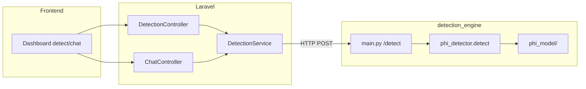

# PHI model integration, testing, and accuracy

## How the model is wired in the project



- **Trained weights:** `detection_engine/phi_model/` (`config.json`, `model.safetensors`, tokenizer files).
- **Inference:** [`phi_detector.py`](../detection_engine/phi_detector.py) loads the model when `USE_ML=1` (default) and merges ML spans with regex (SSN, email, phone, MRN, dates, etc.) and entropy heuristics.
- **API:** Laravel [`DetectionService`](../laravel-backend/app/Services/DetectionService.php) calls `DETECTION_ENGINE_URL` + `/detect` (default `http://127.0.0.1:8001`).

## Accuracy (reported on Colab hold-out test set)

Metrics are stored in **`detection_engine/phi_model/eval_report.json`** (exported with the model). Example fields:

| Metric     | Typical (your export) |
|-----------|------------------------|
| F1        | ~0.996                 |
| Accuracy  | ~0.995                 |
| Precision | ~0.995                 |
| Recall    | ~0.996                 |
| n_test    | ~1869 sequences        |

Token-level evaluation on the same split is **~90k tokens** (`n_tokens_eval`). These numbers are for the **token classification** task (B-/I-PHI vs O), not end-to-end redaction F1.

### Recompute accuracy locally

1. Produce `data/cleaned/test.json` (run `scripts/clean_phi_data.py` after raw data in `data/raw/`).
2. From `detection_engine/`:

   ```bash
   source venv/bin/activate   # if using venv
   python scripts/evaluate_phi_model.py
   ```

3. Results are printed and saved to `phi_model/eval_report_local.json`.

If `test.json` is missing, the script prints `eval_report.json` (Colab metrics) instead.

## Run automated tests (edge cases + API)

From **`detection_engine/`**:

```bash
pip install -r requirements.txt
pytest tests/ -v
# Full stack (regex + Colab NER); requires torch:
pytest tests/test_phi_ml_optional.py -v -m ml
```

Covers:

- Empty / whitespace input
- Regex: SSN, email, phone, MRN, dates
- Very long text (truncation path)
- Unicode mixed text
- `USE_ML=0` (regex-only path) for most tests so CI works without GPU
- Optional `-m ml`: hybrid NER + regex when torch is installed
- FastAPI: `/health` (`phi_model_loaded`), `/detect`, payload size limit (50k chars)

## Run the engine for Laravel / frontend

```bash
cd detection_engine
uvicorn main:app --host 127.0.0.1 --port 8001
```

Laravel `.env`:

```env
DETECTION_ENGINE_URL=http://127.0.0.1:8001
```

Check: `GET http://127.0.0.1:8001/health` → `phi_model_loaded: true`.

## Pending / checklist (full stack)

| Item | Status |
|------|--------|
| `phi_model/` present with `config.json` | Required for ML path |
| Detection engine running on 8001 | Required for Laravel detect/chat |
| `DETECTION_ENGINE_URL` in Laravel | Required |
| `data/cleaned/test.json` | Optional; needed for **local** metric re-run |
| RAG corpus / ChromaDB | Optional for `/rag`; chat still needs engine up |
| `OPENAI_API_KEY` | Required for chat completion |

## Performance note

The NER model is **loaded once per process** and cached (first `/detect` may be slower; subsequent requests reuse the same model).
